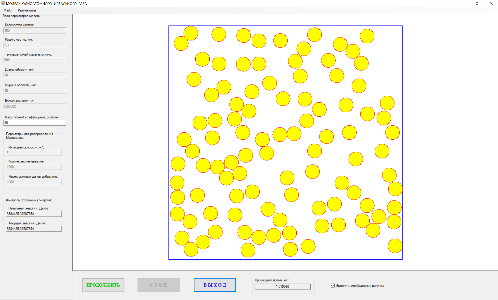
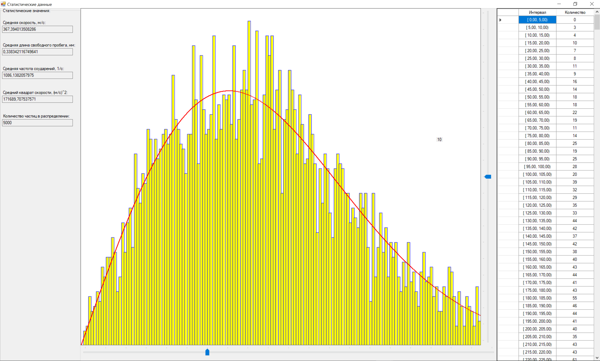

RU:

# IdealGasSimulator — Одноатомный идеальный газ (2D)

Windows Forms-симулятор **двумерного одноатомного идеального газа** (модель твёрдых сфер) с
**упругими столкновениями частица–частица** и **частица–стенка**.  
Включает визуализацию в реальном времени, базовую статистику и гистограмму скоростей с наложением
теоретической **кривой распределения Максвелла**.

## Скриншоты

**Главное окно симуляции**

**Окно статистики (гистограмма скоростей + кривая Максвелла)**

## Возможности

- Движение частиц в прямоугольной области (2D)
- Упругие столкновения:
  - отражение от стенок
  - столкновения частиц (твёрдые сферы одинаковой массы)
- Визуализация частиц в реальном времени
- Окно статистики:
  - средняя скорость
  - средняя длина свободного пробега
  - частота соударений
  - ⟨v²⟩ (средний квадрат скорости)
  - гистограмма распределения скоростей + теоретическая кривая Максвелла

## Сохранение / загрузка результатов моделирования (`.moig`)

Симулятор поддерживает сохранение и загрузку состояния/результатов моделирования в **бинарном формате `.moig`**:
- Используй меню приложения **Файл → Сохранить...**, чтобы сохранить текущее состояние модели в файл (рекомендуемое расширение: `.moig`).
- Используй **Файл → Открыть...**, чтобы загрузить ранее сохранённый `.moig` файл.
- Также приложение может автоматически сохранять снимок состояния в **`temporary.moig`** (автосохранение).

> Примечание: `.moig` — внутренний бинарный формат проекта. Файлы лучше открывать той же версией приложения, которой они были сохранены.

## Быстрый старт

### Требования
- Windows
- Visual Studio с рабочей нагрузкой **.NET desktop development**

### Сборка и запуск
1. Открой `IdealGasSimulator.sln` в Visual Studio
2. Собери решение (Build)
3. Запусти проект (Run)

## Как пользоваться

1. Задай параметры модели (число частиц, радиус, шаг по времени, размеры области и т.д.)
2. Нажми **Start**, чтобы запустить моделирование
3. Открой окно **Statistics**, чтобы посмотреть гистограмму и измеренные значения
4. При необходимости сохрани состояние модели в файл `.moig` через меню

## Структура репозитория

- `IdealGasSimulator.sln` — решение Visual Studio
- `IdealGasSimulator/` — проект WinForms
  - `MainForm.*` — главное окно и логика симуляции
  - `StatisticsForm.*` — статистика и график распределения Максвелла
  - `Program.cs` — точка входа

ENG:

# IdealGasSimulator — Monatomic Ideal Gas (2D)

A Windows Forms simulation of a **2D monatomic ideal gas** (hard-sphere particles) with
**elastic particle–particle** and **particle–wall** collisions.  
Includes real-time visualization, basic statistics, and a speed histogram with a theoretical
**Maxwell distribution** overlay.

## Screenshots

**Main simulation window**

**Statistics window (speed histogram + Maxwell curve)**

## Features

- 2D particle dynamics in a rectangular box
- Elastic collisions:
  - particle–wall reflection
  - particle–particle collisions (equal-mass hard spheres)
- Live visualization of particles
- Statistics window:
  - mean speed
  - mean free path
  - collision frequency
  - ⟨v²⟩ (mean square speed)
  - speed histogram + theoretical Maxwell curve overlay

## Saving / Loading simulation results (`.moig`)

The simulator supports saving and loading the simulation state/results using a **binary `.moig` format**:
- Use the application menu **File → Save...** to store the current model state to a file (recommended extension: `.moig`).
- Use **File → Open...** to load a previously saved `.moig` file.
- The app can also automatically save a snapshot to **`temporary.moig`** (auto-save).

> Note: `.moig` is a project-specific binary format. Files should be read/written in the same version of the app.

## Getting Started

### Requirements
- Windows
- Visual Studio with **.NET desktop development** workload

### Build & Run
1. Open `IdealGasSimulator.sln` in Visual Studio
2. Build the solution
3. Run the project

## Usage

1. Set model parameters (particle count, radius, timestep, domain size, etc.)
2. Press **Start** to run the simulation
3. Open the **Statistics** window to view the histogram and measured values
4. Optionally save the model state to a `.moig` file via the menu

## Repository structure

- `IdealGasSimulator.sln` — Visual Studio solution
- `IdealGasSimulator/` — WinForms project
  - `MainForm.*` — main simulation UI and core logic
  - `StatisticsForm.*` — statistics and Maxwell distribution plot
  - `Program.cs` — entry point
